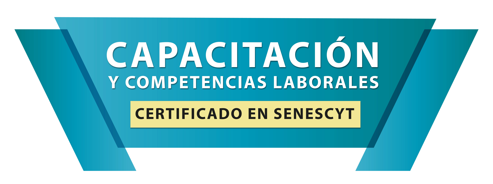

# APDREEPLAG

La asociación de Rectores y directores de escuelas particulares laicos, populares del Guayas (APDREEPLAG), es una organización que ofrece capacitaciones y emite certificaciones por competencias laborales tanto a entidades públicas como a personas jurídicas y naturales en diversos sectores. Nuestra misión es mejorar las habilidades y competencias laborales de los trabajadores ecuatorianos, garantizando un proceso de aprendizaje efectivo y reconocimiento formal de las capacidades adquiridas.

